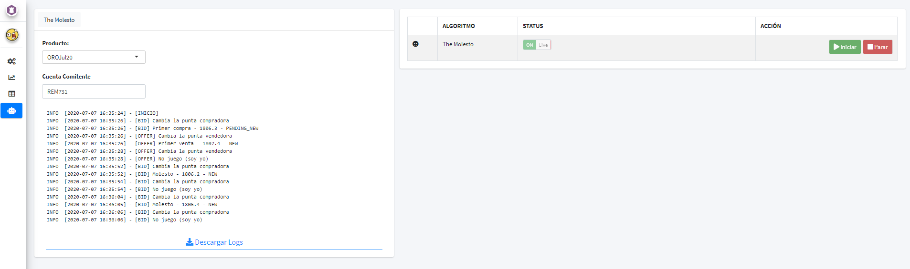

```{r, include = FALSE}
knitr::opts_chunk$set(
  collapse = TRUE,
  comment = "#>"
)
```

This post is not an attempt to explain in detail how to build a Shiny application, rather it is to show a few interesting things that one can build using Shiny in conjuction with the rRofex library. 

I hope that this serves as a starting point and an insipiration for others to build their own solutions.

### The applicaction

The full application can be run either locally using a Gist from GitHub or one can access the online version:

- **Locally**. In your R console, you just have to run the following code: 
```{r eval=FALSE, include=TRUE}
shiny::runGist(gist = "https://gist.github.com/augustohassel/4eea614f80a8bbc548b2b4c3c5edd7c3")
```

- **Online**. If you want to test the application without having to run it locally, you can use this [link](https://demo.hasselpunk.com/rRofex/) or take a peek just right down here.

<div style="height: 45vh;"><iframe src = 'https://demo.hasselpunk.com/rRofex/' class='shiny-app' style='overflow: hidden;width: 165%;height: 700px;-ms-zoom: 0.85;-moz-transform: scale(0.85);-moz-transform-origin: 0px 0;-o-transform: scale(0.85);-o-transform-origin: 0 0;-webkit-transform: scale(0.6);-webkit-transform-origin: 0 0;'></div>

#### Features

The main features of this application are:

1. Login into any endpoint allowed within the API
2. Real time plotting using websocket protocol
3. Real time compute of CCL using REST protocol
4. A primer on algorithmic trading using R and websocket

**I will describe briefly each feature pointing out some relevant code for a better understanding.**

##### **1. Login**

At the very begining of the server function one can found a reactive value called `global_connection`. Each session will have it's own connection, so we don't have to worry about mixing information across sessions.  

```{r eval=FALSE, include=TRUE}
global_connection <- reactiveValues(conn = NULL)
```

Once we login using the <a href='https://matbarofex.github.io/rRofex/reference/trading_login.html' target='_blank'>trading_login()</a> function, the created object will be stored inside `global_connection$conn`.

```{r eval=FALSE, include=TRUE}
withCallingHandlers({
  global_connection$conn <- trading_login(username = input$username, password = input$password, base_url = input$base_url)
  },
  message = function(m) {output$console_login <- renderPrint({m$message})},
  warning = function(m) {output$console_login <- renderPrint({m$message})}
  )
```

Every connection object will be destroyed at the end of each session.

##### **2. Plotting data using a websokcet connection**

In the same maner as with th login, here we start by creating a reactive value that will contain the final market data, called `global_graficos`, and an environment created with `rlang::env()` in which we will store each websocket element, namely the connection itself and the pre procesed market data.

```{r eval=FALSE, include=TRUE}
global_graficos <- reactiveValues(data = NULL)
environment_graficos_iniciar <- rlang::env()
```

When pressing 'Iniciar' two things happen on the server:

1. A websocket connection will be created using <a href='https://matbarofex.github.io/rRofex/reference/trading_ws_md.html' target='_blank'>trading_ws_md()</a>. This will be the responsible to ingest matket data from the selected instrument.
2. A reactive data source will be created to read-in the latter.

```{r eval=FALSE, include=TRUE}
observeEvent(input$graficos_iniciar, {
  if (is.null(global_connection$conn)) {
    sendSweetAlert(session = session, title = HTML("Mmm..."), text = HTML("Tenes que conectarte primero..."),  type = "warning", html = TRUE)
  } else {

    trading_ws_md(connection = global_connection$conn,
                  destination = "data",
                  symbol = input$graficos_producto,
                  entries = list("LA"),
                  listen_to = list("LA_price"),
                  where_is_env = environment_graficos_iniciar)

    global_graficos$data <- reactivePoll(intervalMillis = 1000,
                                         session = session,
                                         checkFunc = function() {
                                           if (!is.null(environment_graficos_iniciar$data)) max(environment_graficos_iniciar$data$timestamp)
                                         },
                                         valueFunc = function() {
                                           return(environment_graficos_iniciar$data)
                                         })
  }
})
```

It is important to notice that we are explicitly using the parameter **where_is_env** from `trading_ws_md()` function and we are poiting it out to our newly created environment. If we weren't using this parameter we would have a mixup of data between sessions because each one would be overwriting  the global environment. In this away every sesions starts it's own environment for the websocket elements.

For more information about scoping rules I strongly suggest this reading: <a href='https://shiny.rstudio.com/articles/scoping.html' target='_blank'>Scoping rules for Shiny apps</a>.

Once data it's being acquired we will build and update the plot using the `plotly` library.

```{r eval=FALSE, include=TRUE}
  output$graficos_grafico <- renderPlotly({
    shiny::validate(
      need(is.reactive(global_graficos$data) && 
             !is.null(global_graficos$data()) && 
             nrow(global_graficos$data()) > 0, 
           message = "Aún no hay data.")
    )
    plot_ly(data = global_graficos$data(), 
            x = ~LA_date, 
            y = ~LA_price, 
            mode = 'line') %>% 
      layout(title = input$graficos_producto, 
             xaxis = list(title = "Timestamp"), 
             yaxis = list(title = "Precio"))
  })
```

##### **3. Real time compute of CCL using REST protocol**

We start by defining what's the **CCL** on a function called outside the server scope. 

> The CCL is a foreign exchange ratio. It basically tells us how many pesos do we need do buy a single dollar, this by calculating the ratio of the local instrument price and its foreign complement.

```{r eval=FALSE, include=TRUE}
ccl <- function(connection, data) {
  message(glue("Busco la market data de los {n} productos locales y extranjeros...", n = nrow(data)))
  precio_local <- map_df(.x = as.list(data$Local), .f = ~ trading_md(connection = connection, symbol = .x, entries = list("LA", "BI", "OF")))
  precio_extranjero <- rownames_to_column(getQuote(Symbols = data$Extranjero), var = "Symbol") %>% rename(TradeTime = `Trade Time`)

  message(glue("Uno las tablas y calculo el CCL.."))
  data <- data %>%
    left_join(precio_local %>% select(Symbol, LA_date, LA_price, BI_price, OF_price), by = c("Local" = "Symbol")) %>%
    left_join(precio_extranjero %>% select(Symbol, TradeTime, Last), by = c("Extranjero" = "Symbol")) %>%
    mutate(
      CCL_Last = (LA_price / Last) * Factor,
      CCL_Bid = (BI_price / Last) * Factor,
      CCL_Offer = (OF_price / Last) * Factor
    ) %>%
    mutate(across(.cols = starts_with("CCL_"), .fns = ~ ifelse(. == 0, NA_real_, .))) %>%
    mutate(
      CCL_Last = case_when(
        CCL_Last %in% boxplot.stats(x = .$CCL_Last, coef = 3)$out ~ NA_real_,
        TRUE ~ CCL_Last
      )
    )

  return(data)
}
```

We are obtaining local market data with the function <a href='https://matbarofex.github.io/rRofex/reference/trading_md.html' target='_blank'>trading_md()</a> and foreign data it's being queried with `quantomod::getQuote()`. As you have probably noticed, there's a convertion factor that's beeing appliead to the ratio, this has been defined manually on a dataframe outside the server scope.

Once we have selected the instruments and press ‘Iniciar’, the calculation starts and we are going to see something like this:

<p align="center"></p>

- A parameter where we can change the refresh frequency of the data
- A table that can be downloaded with the processed data
- On the right corner we can see the CCL value itself
- A plot with the historical value since the we have started the calculations

A bit of a hack has been made here in order to update the data:

```{r eval=FALSE, include=TRUE}
observe({
  invalidateLater(millis = input$table_ccl_timer * 1000, session = session)

  if (input$table_ccl_status == TRUE) {
    shinyjs::click("table_ccl_iniciar")
  }
})
```

On this observe we are programmatically clicking the 'Iniciar' button with the selected frequency.

##### **4. Algorithmic trading and R**

The difference from REST and websocket protcol that I would like to address is that the first one has a uni-directional nature, while the latter has a bi-direction approach. This meaning that we can open a websocket connection and wait for new data to update automatically  our feed, while with REST we will have to constantly be querying over and over again if it has been any changes on the data. 

The use of websocket in R it's not very common but we have tried to build a simple interface:

- When using rRofex in the console we can use the family `trading_ws_*` to open websocket connections and query market data, look up state of our orders and close connections
- When using rRofex on Shiny the main difference is to create a self contain environment where the connection is going to live and then passing it on into the **where_is_env** parameter.

> We have build a test algorithm that works in this way: *every time new market data is received we put an offer and a bid improving, by the minimun amount, the first line on the order book. By doing this, we try to stay on top of the order book every time.*

This is a simple yey powerfull example. We have called it 'The Molesto'.

Listing to market data is pretty much the same as what we have done within the ploting example, so I want to focus on the algorithm itself.

```{r eval=FALSE, include=TRUE}
observe({

  req(!is.null(global_algoritmos_1$data))
  req(global_algoritmos_1$data())

  logger_algoritmos_1 <- create.logger(logfile = glue("logs/the_molesto_{input$algoritmos_1_producto}_{Sys.Date()}.log"), level = "INFO")

  # Objectivo: colocar una punta molesta, en el bid o en el ask cada vez que cambia el size en cualquiera de los casos

  isolate({

    market_data <- global_algoritmos_1$data()
    productos <- global_productos()

    global_algoritmos_1_ordenes$MinTradeVol <- productos %>% filter(Symbol == input$algoritmos_1_producto) %>% pull(MinTradeVol)
    global_algoritmos_1_ordenes$MinPriceIncrement <- productos %>% filter(Symbol == input$algoritmos_1_producto) %>% pull(MinPriceIncrement)

    if (some(.x = list("BI_price", "BI_size"), .p = ~ . %in% unlist(strsplit(market_data$Changes, ","))) &&
        every(.x = list("BI_price", "BI_size"), .p = ~ . %in% colnames(market_data)) &&
        !is.na(market_data$BI_price)) {

      info(logger_algoritmos_1, str_c("- [BID] Cambia la punta compradora"))

      if (is.null(global_algoritmos_1_ordenes$Bid)) {

        bid <- trading_new_order(connection = global_connection$conn,
                                 account  = input$algoritmos_1_cuenta,
                                 symbol   = input$algoritmos_1_producto,
                                 side     = "Buy",
                                 quantity = global_algoritmos_1_ordenes$MinTradeVol,
                                 price    = market_data$BI_price + global_algoritmos_1_ordenes$MinPriceIncrement)

        global_algoritmos_1_ordenes$Bid <- append(x = global_algoritmos_1_ordenes$Bid, values = bid$clOrdId)
        global_algoritmos_1_ordenes$BidPrice <- append(x = global_algoritmos_1_ordenes$BidPrice, values = bid$price)

        info(logger_algoritmos_1, glue("- [BID] Primer compra - {price} - {status}",
                                       price = bid$price,
                                       status = bid$status))
      } else {

        if (market_data$BI_price == last(global_algoritmos_1_ordenes$BidPrice) &&
            market_data$BI_size == global_algoritmos_1_ordenes$MinTradeVol) {

          info(logger_algoritmos_1, glue("- [BID] No juego (soy yo)"))

        } else {

          bid <- trading_new_order(connection = global_connection$conn,
                                   account  = input$algoritmos_1_cuenta,
                                   symbol   = input$algoritmos_1_producto,
                                   side     = "Buy",
                                   quantity = global_algoritmos_1_ordenes$MinTradeVol,
                                   price    = market_data$BI_price + global_algoritmos_1_ordenes$MinPriceIncrement)

          global_algoritmos_1_ordenes$Bid <- append(x = global_algoritmos_1_ordenes$Bid, values = bid$clOrdId)
          global_algoritmos_1_ordenes$BidPrice <- append(x = global_algoritmos_1_ordenes$BidPrice, values = bid$price)

          trading_cancel_order(connection = global_connection$conn, id = nth(global_algoritmos_1_ordenes$Bid, -2), proprietary = "PBCP")

          info(logger_algoritmos_1, glue("- [BID] Molesto - {price} - {status}",
                                         price = bid$price,
                                         status = bid$status))
        }
      }
    }
  })
})
```

We are only looking at the bid side just because the offer side works the same.

We can see that mostly everything has been wrapped up into an isolate function, this avoids to make build an infinite loop every time some new data entered into the algorithm. **This is the most important thing to remember**, everything else are just simple 'if and else' with the logic of what we have to do every time new data has been presented.

Anyone can test this algorithm by putting their own credentials from the test environment reMarkets. You can generate them <a href='https://remarkets.primary.ventures/' target='_blank'>here</a>.

This is how it looks when the algorithm starts:

<p align="center"></p>

#### Closing remarks

Again, this was not suppose to be an indepth guide on how to build a Shiny app, nor how to code algortithms for trading. Instead, this was only an atempt to show some use cases of the rRofex library within Shiny and to encourage those who want to use R on the financial markets. *It is my hope that anyone that have seen this application could get some inspiration while building their own path.*

Let's stay in touch!
